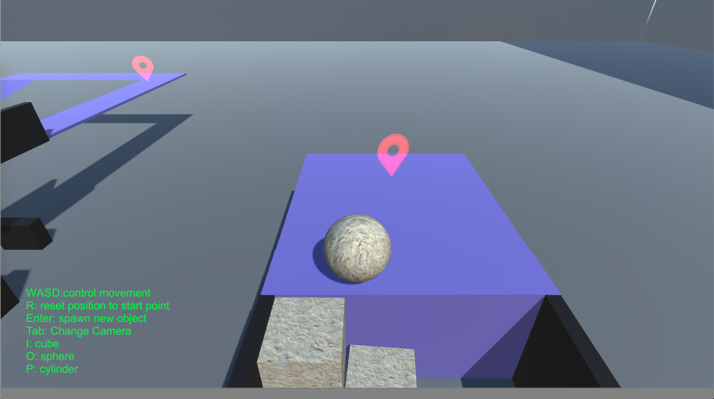

# Geomees 

## Introduction
Unity 3D Game Prototype
**Geomees** is a puzzle game prototype, core features include:

* Major Objective: control object to reach specific destination
* Secondary Objective: many feasible ways to sovle the puzzle, try to use as less primitives as possible
* Players can alternate three primitive types - *cube*, *sphere* and *cylinder* during game
* Players can place primitive where they want and respawn new primitives
* Physically-based control 

## Control

* `W,A,S,D` : move objects by adding physical force 
* `I,O,P` : alternate primitive between `Cube, Sphere, Cylinder`
* `Enter` : respawn a new primitive, the previous one will remain where it was placed
* `Tab` : change camera view to an overall look (from above) 
* `R` : reset position to start position (only current primitive)
 
## Sample Game Play
### Available Primitives
|cube|sphere|cylinder|
|-----|------|-------|
||||

------
### Puzzle Sample 1
Try to reach the destination which is on the higher level, we **could**

|1. reach the edge|2. change to cylinder and roll over to higher level|3. get through the bridge|
|----|----|----|
||||

**or**

|1. place assistant cubes under bridge|2. step on the cubes you just placed|3. done!|
|----|----|----|
||||

------
### Puzzle Sample 2
To get over a high wall, maybe this could work:

|1. place cubes on the first layer|2. alternate to cylinder and reach the second layer |3. place cubes on the second layer|
|----|----|----|
||||

|4. on the second layer alternate to cylinder|5. roll over the higer level |6. done|
|----|----|----|
||||

------ 
### Puzzle Sample 3 
A hole?

|1. falling into a hole, alternate to cube and respawn|2. repeat *filling* the hol3|3. done|
|----|----|----|
||||